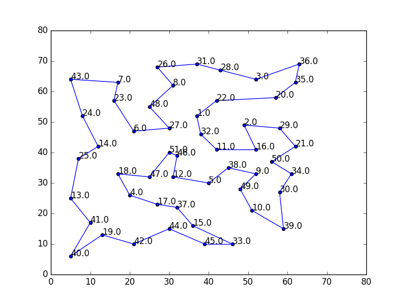
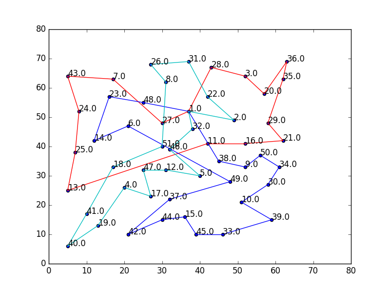
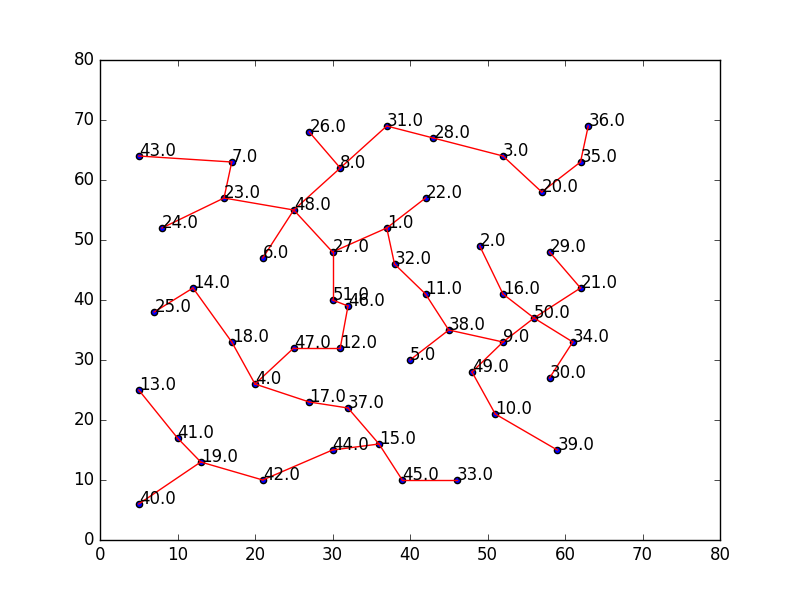
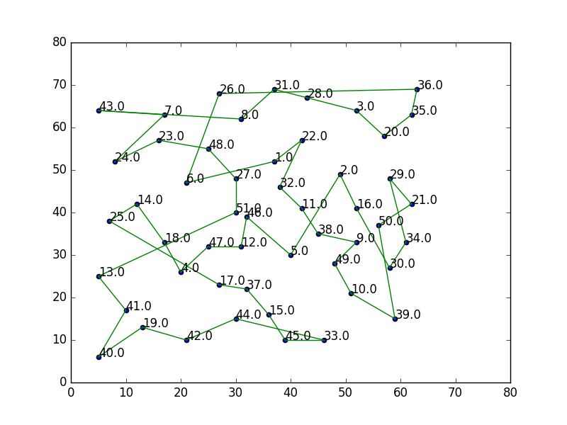
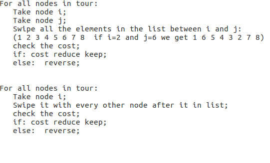
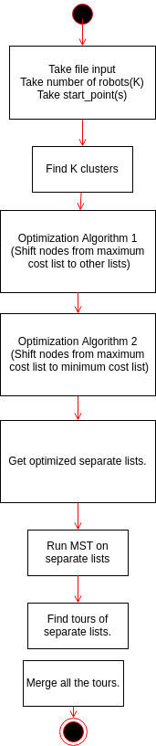

<h1 align="center"> Travelling_Salesman_problem</h1>

[](https://github.com/rohit517/prometheus_frontier_explorer/blob/master/LICENSE)

## Overview
<p float="left">
  
   
</p>

The travelling salesman problem (TSP) asks the following question: "Given a list of cities and the distances between each pair of cities, what is the shortest possible route that visits each city and returns to the origin city?" It is an NP-hard problem in combinatorial optimization, important in operations research and theoretical computer science. This project is about solution to travelling salesman problem with 2 approximation. It also has extension for k robots also following images are oprimized routes for one and k robots.  

## Development Process

[Video Demonstration](https://www.youtube.com/watch?v=74EUgazKQqM)

### Implementation MST

1. Pre-processing of input .tsp file: Using csv given file was opened and converted to list with delimiter
space. This gave output of list of all lines present in .tsp file.
Finally, first 6 lines and last line of file were deleted then lines were converted to 2D matrix. So we
received output of (Nx3) matrix where N is number of nodes.
2. Distance matrix : In order to process MST we need cost of each node from other node So we get a
matrix using distance formula of size (NxN) where N will be number of nodes with its diagonal elements
as infinity.
3. Making of MST: Distance matrix we created will be handy now. First of all we will find 2 nodes
with minimum distance between each other. So here we have 1 connection and 2 nodes. All nodes with
connections will be saved in visited list for example initially there will be 2 nodes in visited. Logic of
making MST : Find the nearest node from some node in visited list excluding visited node
this will avoid loops and will ensure we get a tree at the end. Following is the output after implementing
that algorithm in terms of dictionary.



### Implementation of Tour from MST:

Once we get MST we implement DFS and get a sequence of nodes which will result in a tour.
Note: Apply DFS to the top most point in the MST which is first element in MST.
So from the given MST we get a tour for first data set of eil51.tsp



### Optimization Algorithms



## License
```
/*
 BSD 3-Clause License
 Copyright (c) 2019, Harsh Kakashaniya
 All rights reserved.
 Redistribution and use in source and binary forms, with or without
 modification, are permitted provided that the following conditions are met:
 * Redistributions of source code must retain the above copyright notice, this
 list of conditions and the following disclaimer.
 * Redistributions in binary form must reproduce the above copyright notice,
 this list of conditions and the following disclaimer in the documentation
 and/or other materials provided with the distribution.
 * Neither the name of the copyright holder nor the names of its
 contributors may be used to endorse or promote products derived from
 this software without specific prior written permission.
 THIS SOFTWARE IS PROVIDED BY THE COPYRIGHT HOLDERS AND CONTRIBUTORS "AS IS"
 AND ANY EXPRESS OR IMPLIED WARRANTIES, INCLUDING, BUT NOT LIMITED TO, THE
 IMPLIED WARRANTIES OF MERCHANTABILITY AND FITNESS FOR A PARTICULAR PURPOSE ARE
 DISCLAIMED. IN NO EVENT SHALL THE COPYRIGHT HOLDER OR CONTRIBUTORS BE LIABLE
 FOR ANY DIRECT, INDIRECT, INCIDENTAL, SPECIAL, EXEMPLARY, OR CONSEQUENTIAL
 DAMAGES (INCLUDING, BUT NOT LIMITED TO, PROCUREMENT OF SUBSTITUTE GOODS OR
 SERVICES; LOSS OF USE, DATA, OR PROFITS; OR BUSINESS INTERRUPTION) HOWEVER
 CAUSED AND ON ANY THEORY OF LIABILITY, WHETHER IN CONTRACT, STRICT LIABILITY,
 OR TORT (INCLUDING NEGLIGENCE OR OTHERWISE) ARISING IN ANY WAY OUT OF THE USE
 OF THIS SOFTWARE, EVEN IF ADVISED OF THE POSSIBILITY OF SUCH DAMAGE.
 */

```
## Algorithm to impelement K robot algorithm

<p align="center">
  
</p>

## Instructions to run the program

Instructions for Question 1

1. Unzip the folder structure

(Through terminal go to directory of unzip folder) 

2. Write the following command
```
python one_robot.py -input eil51.tsp
```
(This will provide output MST and an animation of optimization)

Note: If you wish to change data file open the code 
```
python one_robot.py -input <file name>
```
For Example:
```
python one_robot.py -input eil76.tsp
```
All other details are present in Report also video link is available in report.


Instructions for Question 2

(In the same directory of unzip folder)
```
python n_robot.py -input eil51.tsp
```
<follow terminal to enter number to robots and start point >

```
python n_robot.py -input <file name>
```
For Example: 
```
python Question_2.py -input eil76.tsp
```


## Authors/About Us
Harsh Kakashaniya ([harshkakashaniya](https://github.com/harshkakashaniya)) - I am a Masters of Engineering in Robotics student at the University of Maryland, College Park. I am intereted in mobile robots.<br /> <br />
